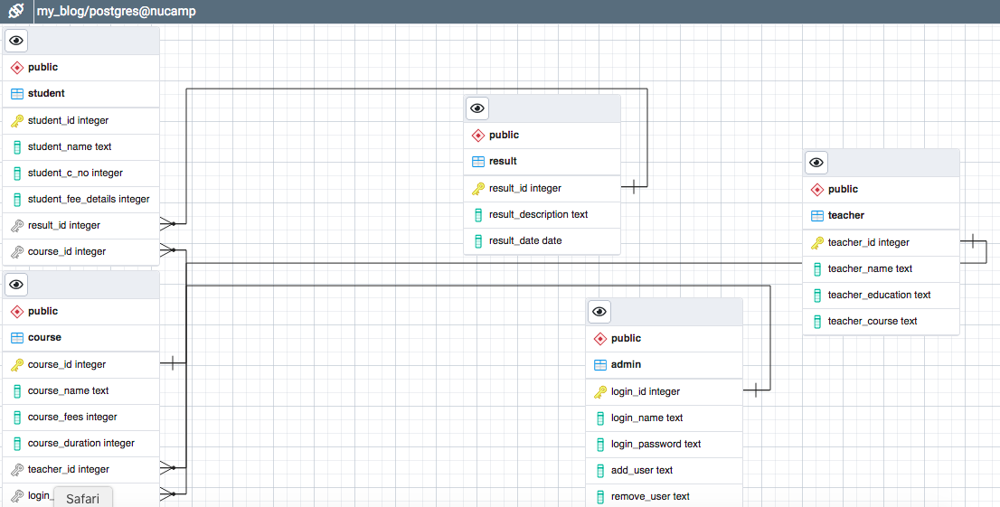
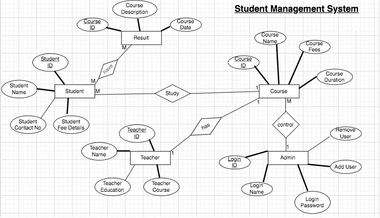

Title: Student Management System

**Description**: 
The student management system has been created in Python program. For the database, I have used Postgres SQL. So, the program executes the SQL query in order to update the backend databse file. In the learning face, I could not do more but I will keep updating it and finally  makes an interactive menu driven school management system.

**Inside the Program**
The program display a menu for the user; student page, teacher page, course page, result page, admin page and exit. In the future, I will keep updating this program and eventually I will make an interactive student management system. Under the student page, it allows the user to view student list, add new student and remove student from the database. Similarly, under the teacher page, course page and admin page, it also allows the similar activities; add, view and remove facilities.

The postgres sql queries are able to execute in python with the help of psycopg.

**Retrospective**
How did the project evolve over time?
Initially, I have prepared student management system by using ORM but it could only the activities with student only. As per the deadline, I 
thought of completing afterwards, so, at the moment, I want to go with raw SQL.

Did you choose to use an ORM or raw SQL? Why?
I know, ORM is more easy and much more easy to interact with database, for this time, I want to go with raw SQL. Later, I will update with ORM.

What future improvements are in store, if any?
In the future, I want to update to ORM, make more interactive and user-friendly student management system.

Some Screenshots of Student Management System
**ER Diagram**

**Flow Chart**

**Database Myblog**

**Program Looks**

# pproject
# myproject
# myproject
